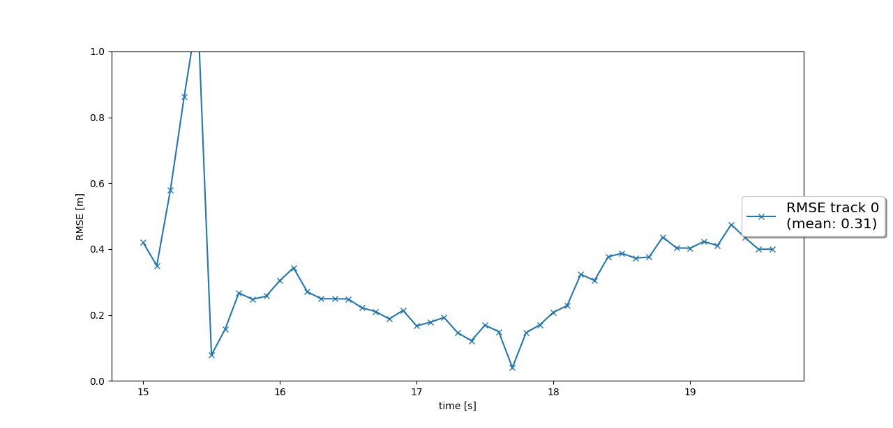
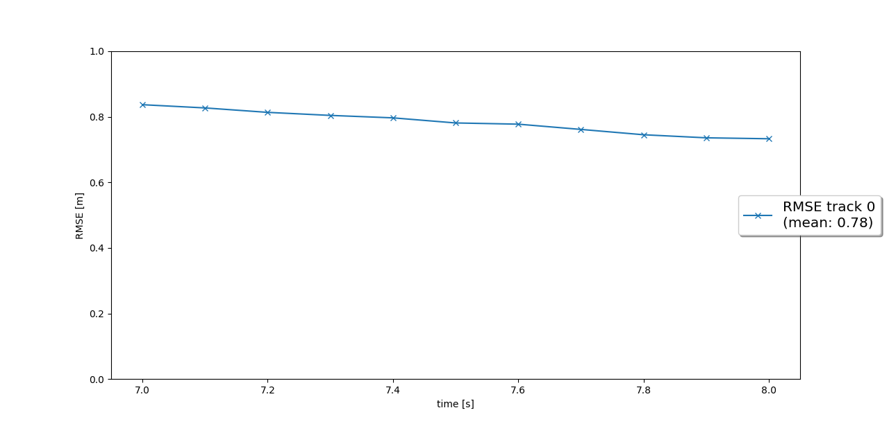
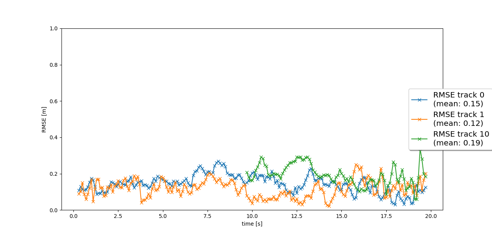
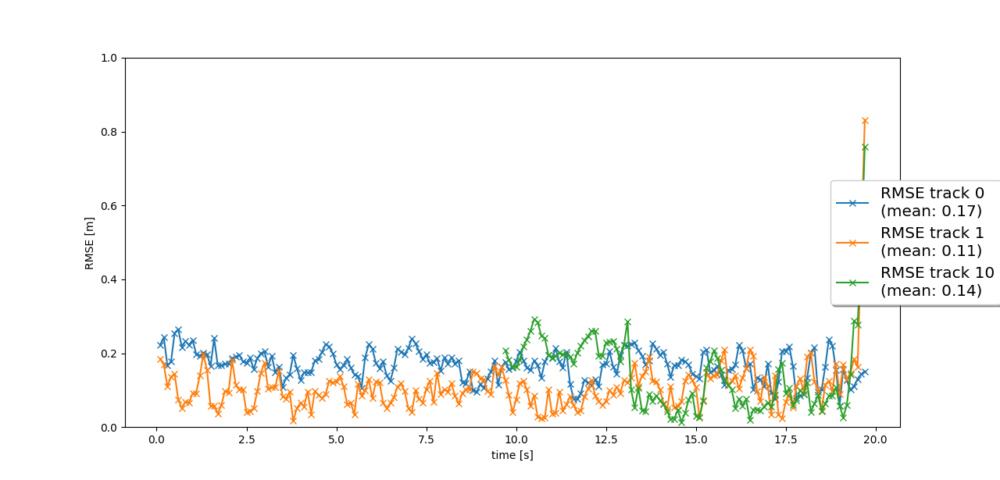

# Track 3D-Objects Over Time

This project is intended to implement a real use case of sensor fusion system using both Camera and Lidar sensors

### 1. Write a short recap of the four tracking steps and what you implemented there (filter, track management, association, camera fusion). Which results did you achieve? Which part of the project was most difficult for you to complete, and why?

During first phase of the project, an Extended Kalman Filter to track a single target using only lidar measurement is implemented. We uses Root Mean Square Error to asses system performances. The following chart presents the RMSE results.

In the second phase, a track management module is introduced to initialize/update or delete tracks. With these module we obtain the following RMSE chart.

In the third part, an association module is implemented to match measurements to track. In these phase, the tracking is done across multiple targets. (Here three targets)

In the final stage of the project, we introduce the camera sensor in addition to lidar sensor. the final results can be found below.

We observe that the RMSE for track 1 and 10 is lower with the introduction of camera sensor.

To resume, we using the following modules:

>- Kalman Filter: compute Kalman Filter parameters, state prediction and motion update
>- Track Management: allow to manage different tracking object tracks. Mainly add, delete and update tracks.
>- Association: allow to match a measurements with tracks by using Mahalanobis distance and gating.

Regarding difficulties of these project: the most difficult part was to debug when something is not working as expected.

### 2. Do you see any benefits in camera-lidar fusion compared to lidar-only tracking (in theory and in your concrete results)? 

In theory:
>- As any sensor has it's own acquisition rate, sensor fusion allow to have a more reliable system that can be updated more frequently.
>- Camera-Lidar sensor fusion uses two sensors with different point of view, angles that allows to compensate some defaults of other sensors. Camera can't estimate well enough the depth but lidar does. In opposite the camera brings, for example color space for object detection.
>- Increase in detection or tracking accuracy.
>- Weather robustness, each sensor is more or less sensitive to the weather. Using multiple sensors allows to builds a very robust systems for all weather conditions.

During this project, we observe the reduction of incorrect results after camera sensor introduction in addition to lidar sensor.

### 3. Which challenges will a sensor fusion system face in real-life scenarios? Did you see any of these challenges in the project?

Sensor fusion system will face several difficulties in real-life applications:

>- Used constant are situation specific. Find a constant that models all use cases that the system will encounter is really difficult.
>- Complexe scenarios

### 4. Can you think of ways to improve your tracking results in the future?

>- As many constant variable were already provided, fine tune those constant may improve the results.
>- Use of more advanced algorithm. As mentioned during the lecture, there is more advanced and better algorithms than the one used for this project.
>- Use additional sensors

