# Writeup: Mid Term Project

For this midterm project, the following tasks had to be carried out

- ID_S1_EX1: Display Range and Intensity Images and convert Range image to 3D Point Cloud representation.
- ID_S1_EX2 : Display 3D Point Cloud using the Open3D library.
- ID_S2_EX1 : Create Birds Eye View perspective (BEV) from 3D point cloud representation
- ID_S2_EX2,ID_S2_EX3 : Compute Intensity and Height map.
- ID_S3_EX1 : Integrate an additional detector, the FPN ResNet [repository](https://review.udacity.com/github.com/maudzung/SFA3D)
- ID_S3_EX2 : Convert BEV coordinates into pixel coordinates and convert model output to bounding box format
- ID_S4_EX1 : Process detection by thresholding IoU overlap
- ID_S4_EX2,ID_S4_EX3 : Compute detection performances such as  precision and recall

All tasks were applied to real-world data provided by  [Waymo Open Dataset's](https://console.cloud.google.com/storage/browser/waymo_open_dataset_v_1_2_0_individual_files).

To run the project uses the entry point file loop_over_dataset.py as follows: 

```
python loop_over_dataset.py
```

## Analysis

By looking to different images, we noticing that the intensity is more important on reflective objects such as licence plates, line marking, road signs, tail lights or the rear bumper. Identifying by green boxes on different images. In some cases the headover lights, car front lights, rear window shields can also be detected through the intensity channel.

If we remove a side reflectance variable due to materials , we noticing that the intensity is stronger when the surface is perpendicular to the laser beam. If we take the example below, the first car, the rear with correctly identifiable on all representation, but the side is only visible on the range images and 3D Point Cloud.

By looking to lidar perspective, either 3D Point Cloud or Range Images, the everall volumes are most identifiable, in case of a car, the chassis. 

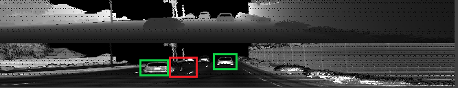
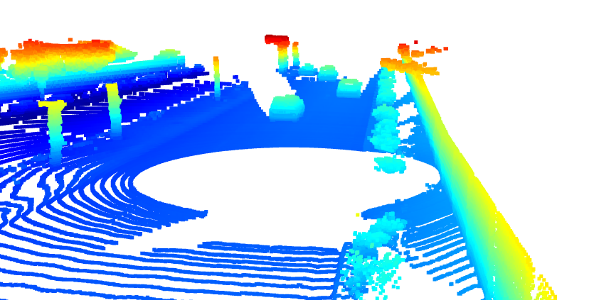

This second example below, really demonstrates the impact of reflective materials on the intensity channel. The road line markings and the road signs have a much higher intensity than most of other objects. But ig we looking to range images or 3D point cloud it becomes almost impossible to identify those elements.
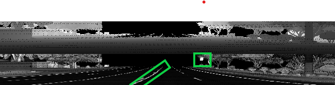
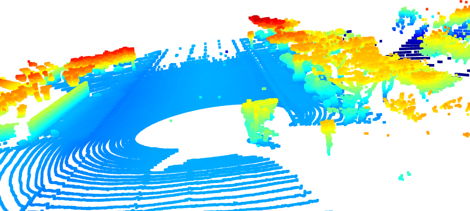

The other examples demonstrates the same effects, that both intensity and range/point clouds needs to be considered to really improve the detection.
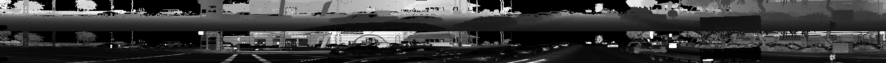
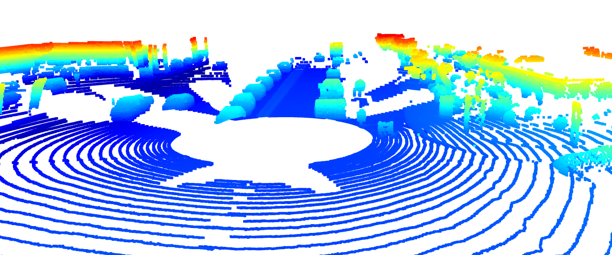

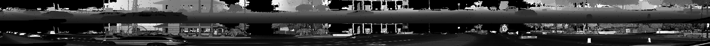
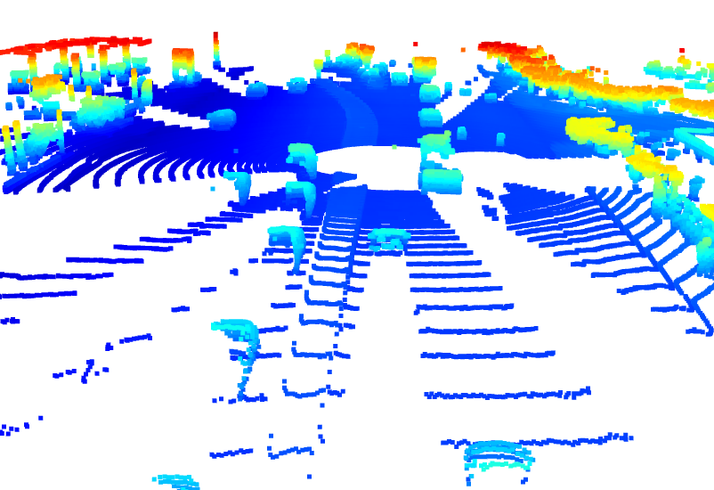

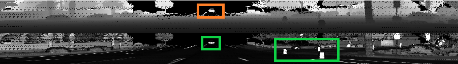
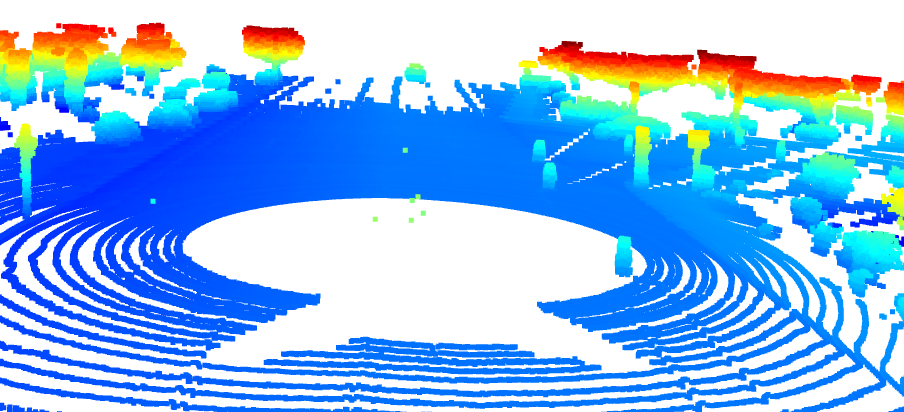

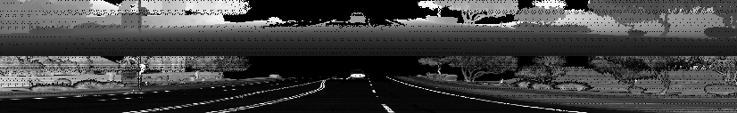
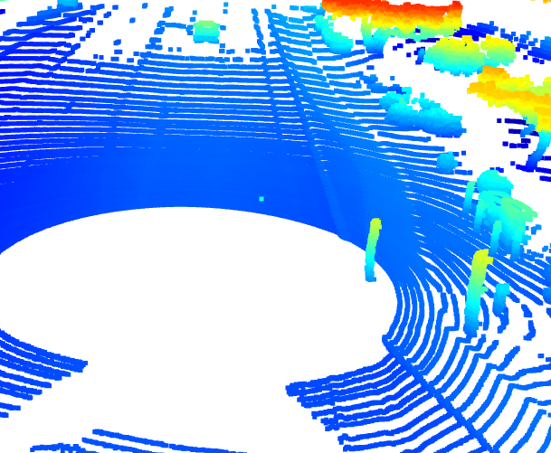

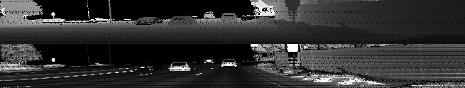
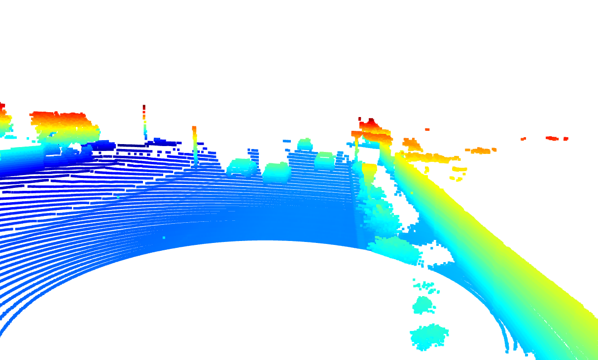


## Performance Evaluation
 Measured Precision across 100 images on dataset 1 is as follows:

 - Precision: 0.95
 - Recall: 0.94
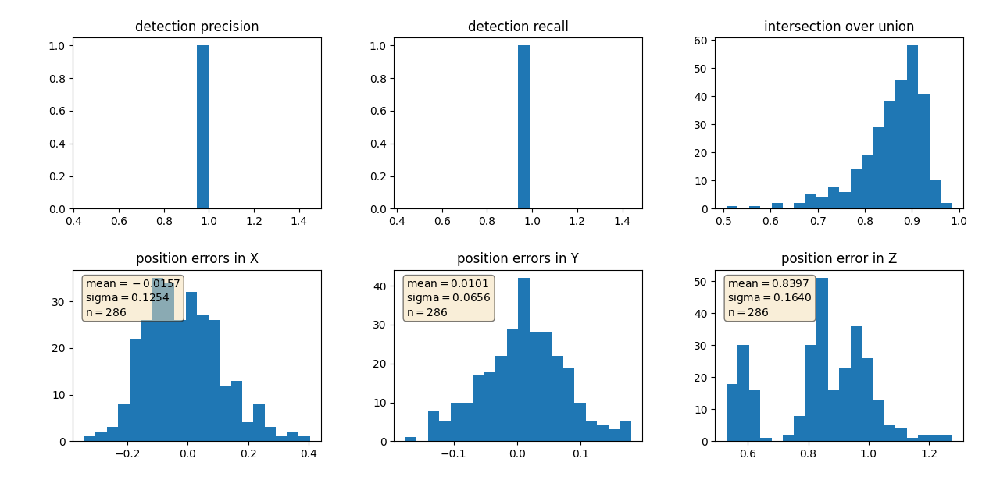

The results are not as expected in the Project Instructions Step4, but by activating 
<code>
configs_det.use_labels_as_objects=True
</code>

We obtain the expected results of 1 for both precision and recall
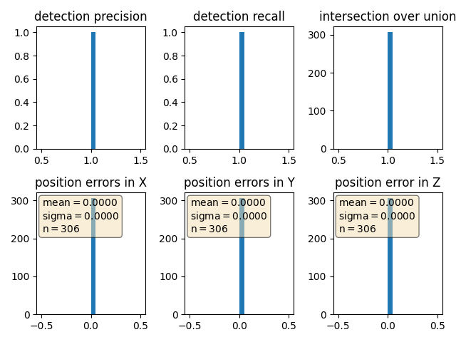
It means that our code is probably working.